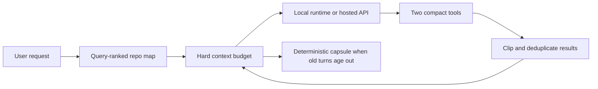

<div align="center">

# YCode

**A fast coding-agent harness with a hard token budget.**

[Getting started](#getting-started) · [Why YCode](#why-ycode) · [Configuration](#configuration) · [Security](#security) · [Roadmap](docs/ROADMAP.md)

</div>

> [!IMPORTANT]
> YCode is an early pre-1.0 foundation. It is useful today for OpenAI-compatible
> coding-agent workflows, but some advanced integrations are still on the
> roadmap.

## Why YCode

Most coding agents spend context like it is free. YCode makes the context budget
an architectural constraint:

- **Query-ranked repo map** — sends filenames and useful symbols, not the whole repository.
- **Two-tool surface** — one `workspace` tool and one `shell` tool keep repeated schema cost small.
- **Deterministic compaction** — old turns become a bounded local capsule without another model call.
- **Content-addressed results** — repeated tool output becomes a short reference; oversized output keeps its useful head and tail.
- **Stable prompt prefix** — static instructions stay before dynamic workspace context to improve provider cache reuse.
- **Visible accounting** — `--stats` reports estimated input, output, avoided tokens, map size, and dropped turns.

The runtime is one Go binary with no third-party runtime dependencies. Startup,
repository mapping, session storage, streaming, and tool execution all use the
standard library.

## Install

macOS or Linux:

```bash
curl -fsSL https://raw.githubusercontent.com/yuzu-ux/ycode/main/install.sh | sh
```

Windows PowerShell:

```powershell
irm https://raw.githubusercontent.com/yuzu-ux/ycode/main/install.ps1 | iex
```

The installers download the correct release binary, verify its SHA-256
checksum, and install it in a user-owned bin directory. To choose another
directory, set `YCODE_INSTALL_DIR` before running the installer.

You can also install from source with Go 1.24 or newer:

```bash
go install github.com/yuzu-ux/ycode/cmd/ycode@latest
```

## Getting started

YCode works with local models or a hosted API.

### Local connection — no API key

Start a local server and load a tool-capable model, then let YCode detect it:

```bash
ycode connect local
ycode "explain this repository"
```

YCode checks [Ollama](https://docs.ollama.com/api/openai-compatibility),
[LM Studio](https://lmstudio.ai/docs/developer/openai-compat/tools), and
[llama.cpp](https://github.com/ggml-org/llama.cpp/blob/master/tools/server/README.md).
It saves the selected endpoint and model in your user config. Local mode accepts
only loopback addresses and disables API keys, even if a key exists in your
environment. Discovery only lists installed models; inference does not begin
until you send YCode a prompt. When several models are plausible, YCode asks you
to choose instead of guessing which workload your computer should run.

Choose a specific runtime or installed model:

```bash
ycode connect local --runtime ollama --model "<installed-model>"
```

Use a custom loopback server:

```bash
ycode connect local --base-url http://127.0.0.1:9000/v1
```

### Hosted API

The default connection uses OpenAI's `gpt-4.1-mini`:

```bash
ycode connect api
export OPENAI_API_KEY="..."
ycode "explain this repository"
```

Local inference uses your computer's CPU/GPU and memory. Switch back to the
hosted connection at any time with `ycode connect api`.

Interactive mode:

```bash
ycode
```

Build from source:

```bash
git clone https://github.com/yuzu-ux/ycode.git
cd ycode
make check
make install
```

YCode defaults to OpenAI's `gpt-4.1-mini`, but every provider setting is
configurable. For another hosted OpenAI-compatible provider:

```bash
export OPENROUTER_API_KEY="..."
ycode connect api \
  --base-url https://openrouter.ai/api/v1 \
  --api-key-env OPENROUTER_API_KEY \
  --model "<provider/model>"
ycode "add tests for the parser"
```

YCode never writes the key to its config or session files.

## Commands

```text
ycode                              interactive chat
ycode "fix the failing test"       one-shot shorthand
ycode run [flags] <prompt>         one-shot agent
ycode chat [flags]                 interactive agent
ycode connect local [flags]        detect and save a local model connection
ycode connect api [flags]          save a hosted API connection
ycode connect status               show the effective model connection
ycode map [flags] [query]          preview the context sent for a task
ycode benchmark [flags] [query]    measure context reduction locally
ycode init                         create .ycode/config.json and YCODE.md
ycode doctor [--network]           verify configuration and connectivity
ycode sessions                     list resumable sessions
```

Useful flags:

```text
--root PATH
--connection api|local
--model ID
--base-url URL
--budget TOKENS
--map-tokens TOKENS
--tool-output-tokens TOKENS
--shell-policy safe|ask|allow
--read-only
--resume latest|SESSION_ID
--stats
```

Try the zero-API-cost benchmark:

```bash
ycode benchmark "provider streaming"
```

It compares a naïve full-text context with YCode's bounded repository map. The
estimate is intentionally model-independent and slightly conservative; exact
tokenization varies by provider.

## Configuration

Run `ycode init` inside a project, then edit `.ycode/config.json`:

```json
{
  "provider": {
    "connection": "api",
    "base_url": "https://api.openai.com/v1",
    "model": "gpt-4.1-mini",
    "api_key_env": "OPENAI_API_KEY",
    "timeout_seconds": 180,
    "stream": true
  },
  "agent": {
    "input_budget_tokens": 16000,
    "output_tokens": 4096,
    "repo_map_tokens": 1200,
    "tool_output_tokens": 1800,
    "max_turns": 12,
    "shell_policy": "ask"
  }
}
```

Precedence is:

```text
built-in defaults
  < global config
  < .ycode/config.json
  < YCODE_* environment variables
  < command flags
```

The global file lives under the operating system's user config directory.
Sessions live under the user cache directory, are mode `0600`, and are scoped
to a hash of the workspace path.

For isolated automation or tests, `YCODE_CONFIG_DIR` and `YCODE_CACHE_DIR`
override those two operating-system locations.

## How one turn works



See [Architecture](docs/ARCHITECTURE.md) and
[Token efficiency](docs/TOKEN_EFFICIENCY.md) for the precise behavior.

## Security

YCode is designed for real code changes, so it treats tool execution as a
security boundary:

- File paths are confined to the workspace, including symlink resolution.
- File writes are atomic and Git internals cannot be edited through the workspace tool.
- There is deliberately no file-delete action.
- Destructive or privileged shell patterns remain blocked in every policy.
- `safe` permits only focused read/build/test commands.
- `ask` (the default) asks once before other commands in interactive mode.
- One-shot mode cannot silently approve an unsafe command.
- `--read-only` disables file edits.

Read [SECURITY.md](SECURITY.md) before using `--shell-policy allow`.

## Design scope

YCode deliberately keeps its default path focused. It currently provides:

- OpenAI-compatible streaming chat completions and function calls
- keyless local runtime discovery for Ollama, LM Studio, and llama.cpp
- bounded repository context
- a safe editing/search tool
- a policy-controlled shell tool
- resumable local sessions
- interactive and non-interactive modes
- token accounting and a context benchmark

It does not yet provide OAuth login, a full-screen TUI, MCP, native
Anthropic/Gemini protocols, browser automation, swarms, or semantic memory.
Those are tracked in the [roadmap](docs/ROADMAP.md).

## License

[MIT](LICENSE)
